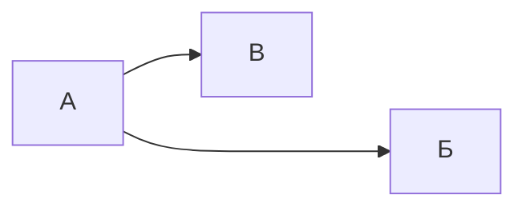

---
{"dg-publish":true,"permalink":"/style-test/","dgHomeLink":true,"dgPassFrontmatter":false}
---


# Style test

## Цитаты

> Переход в мир логарифмов сохранил астрономам тысячи лет жизни.
> 
> Лапласс

## Код

Строчный `код`, доступный в любом месте.

```
Блочный код
```

## Таблицы

| Столбец 1 | Столбец 2 |
| --------- | --------- |
| Строка 1  | Строка 1  |
| Строка 2  | Строка 2  | 

## Форматирование текста

- **Жирное выделение**
- *Курсивное выделение*
- ==Цветное выделение==
- ~~Зачёркнутый текст~~

## Mermaid



## Excalidraw


<div class="transclusion internal-embed is-loaded"><div class="markdown-embed">

<div class="markdown-embed-title">


</div>


# Text Elements
Тело цикла ^OjYJ0Fdo

Начало ^gt4sTJJf

Условие ^Bg19HSHO

Конец ^yfzmv2RU

истина ^L03tZgRw

ложь ^Q8BKkVmZ

Цикл будет продолжаться до тех пор, пока условие является истинным. ^YZ3fkT1f

%%
# Drawing
```json
{
	"type": "excalidraw",
	"version": 2,
	"source": "https://excalidraw.com",
	"elements": [
		{
			"type": "rectangle",
			"version": 60,
			"versionNonce": 1637570404,
			"isDeleted": false,
			"id": "Tv4AQGHhO4tkfJJKHgci3",
			"fillStyle": "hachure",
			"strokeWidth": 2,
			"strokeStyle": "solid",
			"roughness": 0,
			"opacity": 100,
			"angle": 0,
			"x": -120,
			"y": 120,
			"strokeColor": "#000000",
			"backgroundColor": "transparent",
			"width": 160,
			"height": 80,
			"seed": 631188060,
			"groupIds": [],
			"strokeSharpness": "sharp",
			"boundElements": [
				{
					"type": "text",
					"id": "OjYJ0Fdo"
				},
				{
					"id": "t505PEjzilsp2veWgSPXt",
					"type": "arrow"
				}
			],
			"updated": 1654076752230,
			"link": null,
			"locked": false
		},
		{
			"type": "text",
			"version": 168,
			"versionNonce": 2049742820,
			"isDeleted": false,
			"id": "OjYJ0Fdo",
			"fillStyle": "hachure",
			"strokeWidth": 2,
			"strokeStyle": "solid",
			"roughness": 0,
			"opacity": 100,
			"angle": 0,
			"x": -115,
			"y": 148,
			"strokeColor": "#000000",
			"backgroundColor": "transparent",
			"width": 150,
			"height": 24,
			"seed": 2078979420,
			"groupIds": [],
			"strokeSharpness": "sharp",
			"boundElements": [],
			"updated": 1654076740312,
			"link": null,
			"locked": false,
			"fontSize": 20,
			"fontFamily": 3,
			"text": "Тело цикла",
			"rawText": "Тело цикла",
			"baseline": 19,
			"textAlign": "center",
			"verticalAlign": "middle",
			"containerId": "Tv4AQGHhO4tkfJJKHgci3",
			"originalText": "Тело цикла"
		},
		{
			"type": "rectangle",
			"version": 17,
			"versionNonce": 43238628,
			"isDeleted": false,
			"id": "1EQBvT6HboillYs_ExcSA",
			"fillStyle": "hachure",
			"strokeWidth": 2,
			"strokeStyle": "solid",
			"roughness": 0,
			"opacity": 100,
			"angle": 0,
			"x": -120,
			"y": -240,
			"strokeColor": "#000000",
			"backgroundColor": "transparent",
			"width": 160,
			"height": 80,
			"seed": 1539558108,
			"groupIds": [],
			"strokeSharpness": "round",
			"boundElements": [
				{
					"type": "text",
					"id": "gt4sTJJf"
				}
			],
			"updated": 1654076732974,
			"link": null,
			"locked": false
		},
		{
			"type": "text",
			"version": 21,
			"versionNonce": 2088364508,
			"isDeleted": false,
			"id": "gt4sTJJf",
			"fillStyle": "hachure",
			"strokeWidth": 2,
			"strokeStyle": "solid",
			"roughness": 0,
			"opacity": 100,
			"angle": 0,
			"x": -115,
			"y": -212,
			"strokeColor": "#000000",
			"backgroundColor": "transparent",
			"width": 150,
			"height": 24,
			"seed": 194700772,
			"groupIds": [],
			"strokeSharpness": "round",
			"boundElements": [],
			"updated": 1654076668285,
			"link": null,
			"locked": false,
			"fontSize": 20,
			"fontFamily": 3,
			"text": "Начало",
			"rawText": "Начало",
			"baseline": 19,
			"textAlign": "center",
			"verticalAlign": "middle",
			"containerId": "1EQBvT6HboillYs_ExcSA",
			"originalText": "Начало"
		},
		{
			"type": "diamond",
			"version": 40,
			"versionNonce": 938177508,
			"isDeleted": false,
			"id": "jROlqW9Cj-_FRjDIVLhq8",
			"fillStyle": "hachure",
			"strokeWidth": 2,
			"strokeStyle": "solid",
			"roughness": 0,
			"opacity": 100,
			"angle": 0,
			"x": -120,
			"y": -80,
			"strokeColor": "#000000",
			"backgroundColor": "transparent",
			"width": 160,
			"height": 120,
			"seed": 1664982876,
			"groupIds": [],
			"strokeSharpness": "sharp",
			"boundElements": [
				{
					"type": "text",
					"id": "Bg19HSHO"
				},
				{
					"id": "t505PEjzilsp2veWgSPXt",
					"type": "arrow"
				}
			],
			"updated": 1654076752229,
			"link": null,
			"locked": false
		},
		{
			"type": "text",
			"version": 31,
			"versionNonce": 893102684,
			"isDeleted": false,
			"id": "Bg19HSHO",
			"fillStyle": "hachure",
			"strokeWidth": 2,
			"strokeStyle": "solid",
			"roughness": 0,
			"opacity": 100,
			"angle": 0,
			"x": -115,
			"y": -32,
			"strokeColor": "#000000",
			"backgroundColor": "transparent",
			"width": 150,
			"height": 24,
			"seed": 1854688356,
			"groupIds": [],
			"strokeSharpness": "sharp",
			"boundElements": [],
			"updated": 1654076738223,
			"link": null,
			"locked": false,
			"fontSize": 20,
			"fontFamily": 3,
			"text": "Условие",
			"rawText": "Условие",
			"baseline": 19,
			"textAlign": "center",
			"verticalAlign": "middle",
			"containerId": "jROlqW9Cj-_FRjDIVLhq8",
			"originalText": "Условие"
		},
		{
			"type": "rectangle",
			"version": 25,
			"versionNonce": 162944348,
			"isDeleted": false,
			"id": "U_NjNMRw7LxmymGjktROC",
			"fillStyle": "hachure",
			"strokeWidth": 2,
			"strokeStyle": "solid",
			"roughness": 0,
			"opacity": 100,
			"angle": 0,
			"x": -120,
			"y": 280,
			"strokeColor": "#000000",
			"backgroundColor": "transparent",
			"width": 160,
			"height": 80,
			"seed": 1168416484,
			"groupIds": [],
			"strokeSharpness": "round",
			"boundElements": [
				{
					"id": "yfzmv2RU",
					"type": "text"
				},
				{
					"id": "k2q8RQW91xvb7CE2eXeoD",
					"type": "arrow"
				}
			],
			"updated": 1654076771976,
			"link": null,
			"locked": false
		},
		{
			"type": "text",
			"version": 34,
			"versionNonce": 982461540,
			"isDeleted": false,
			"id": "yfzmv2RU",
			"fillStyle": "hachure",
			"strokeWidth": 2,
			"strokeStyle": "solid",
			"roughness": 0,
			"opacity": 100,
			"angle": 0,
			"x": -115,
			"y": 308,
			"strokeColor": "#000000",
			"backgroundColor": "transparent",
			"width": 150,
			"height": 24,
			"seed": 1269051740,
			"groupIds": [],
			"strokeSharpness": "round",
			"boundElements": [],
			"updated": 1654076719295,
			"link": null,
			"locked": false,
			"fontSize": 20,
			"fontFamily": 3,
			"text": "Конец",
			"rawText": "Конец",
			"baseline": 19,
			"textAlign": "center",
			"verticalAlign": "middle",
			"containerId": "U_NjNMRw7LxmymGjktROC",
			"originalText": "Конец"
		},
		{
			"type": "arrow",
			"version": 7,
			"versionNonce": 150963684,
			"isDeleted": false,
			"id": "binQCHEpOBWbMUYh5TA9s",
			"fillStyle": "hachure",
			"strokeWidth": 2,
			"strokeStyle": "solid",
			"roughness": 0,
			"opacity": 100,
			"angle": 0,
			"x": -40,
			"y": -160,
			"strokeColor": "#000000",
			"backgroundColor": "transparent",
			"width": 0,
			"height": 80,
			"seed": 135789412,
			"groupIds": [],
			"strokeSharpness": "round",
			"boundElements": [],
			"updated": 1654076747085,
			"link": null,
			"locked": false,
			"startBinding": null,
			"endBinding": null,
			"lastCommittedPoint": null,
			"startArrowhead": null,
			"endArrowhead": "triangle",
			"points": [
				[
					0,
					0
				],
				[
					0,
					80
				]
			]
		},
		{
			"type": "arrow",
			"version": 20,
			"versionNonce": 1663519434,
			"isDeleted": false,
			"id": "t505PEjzilsp2veWgSPXt",
			"fillStyle": "hachure",
			"strokeWidth": 2,
			"strokeStyle": "solid",
			"roughness": 0,
			"opacity": 100,
			"angle": 0,
			"x": -40,
			"y": 41,
			"strokeColor": "#000000",
			"backgroundColor": "transparent",
			"width": 0,
			"height": 78,
			"seed": 755972700,
			"groupIds": [],
			"strokeSharpness": "round",
			"boundElements": [],
			"updated": 1654077695463,
			"link": null,
			"locked": false,
			"startBinding": {
				"elementId": "jROlqW9Cj-_FRjDIVLhq8",
				"gap": 1,
				"focus": 0
			},
			"endBinding": {
				"elementId": "Tv4AQGHhO4tkfJJKHgci3",
				"gap": 1,
				"focus": 0
			},
			"lastCommittedPoint": null,
			"startArrowhead": null,
			"endArrowhead": "triangle",
			"points": [
				[
					0,
					0
				],
				[
					0,
					78
				]
			]
		},
		{
			"type": "line",
			"version": 9,
			"versionNonce": 2131620572,
			"isDeleted": false,
			"id": "78bwPv2mL4-in_qcIJqOg",
			"fillStyle": "hachure",
			"strokeWidth": 2,
			"strokeStyle": "solid",
			"roughness": 0,
			"opacity": 100,
			"angle": 0,
			"x": -120,
			"y": 160,
			"strokeColor": "#000000",
			"backgroundColor": "transparent",
			"width": 60,
			"height": 0,
			"seed": 435372252,
			"groupIds": [],
			"strokeSharpness": "round",
			"boundElements": [],
			"updated": 1654076754231,
			"link": null,
			"locked": false,
			"startBinding": null,
			"endBinding": null,
			"lastCommittedPoint": null,
			"startArrowhead": null,
			"endArrowhead": null,
			"points": [
				[
					0,
					0
				],
				[
					-60,
					0
				]
			]
		},
		{
			"type": "line",
			"version": 11,
			"versionNonce": 57682532,
			"isDeleted": false,
			"id": "6Bysb86mMXQLttJzbS707",
			"fillStyle": "hachure",
			"strokeWidth": 2,
			"strokeStyle": "solid",
			"roughness": 0,
			"opacity": 100,
			"angle": 0,
			"x": -180,
			"y": 160,
			"strokeColor": "#000000",
			"backgroundColor": "transparent",
			"width": 0,
			"height": 180,
			"seed": 925120740,
			"groupIds": [],
			"strokeSharpness": "round",
			"boundElements": [],
			"updated": 1654076758945,
			"link": null,
			"locked": false,
			"startBinding": null,
			"endBinding": null,
			"lastCommittedPoint": null,
			"startArrowhead": null,
			"endArrowhead": null,
			"points": [
				[
					0,
					0
				],
				[
					0,
					-180
				]
			]
		},
		{
			"type": "arrow",
			"version": 5,
			"versionNonce": 168318684,
			"isDeleted": false,
			"id": "w1WHhb2mNulZ4DWsZXlJy",
			"fillStyle": "hachure",
			"strokeWidth": 2,
			"strokeStyle": "solid",
			"roughness": 0,
			"opacity": 100,
			"angle": 0,
			"x": -180,
			"y": -20,
			"strokeColor": "#000000",
			"backgroundColor": "transparent",
			"width": 60,
			"height": 0,
			"seed": 1254694364,
			"groupIds": [],
			"strokeSharpness": "round",
			"boundElements": [],
			"updated": 1654076759969,
			"link": null,
			"locked": false,
			"startBinding": null,
			"endBinding": null,
			"lastCommittedPoint": null,
			"startArrowhead": null,
			"endArrowhead": "triangle",
			"points": [
				[
					0,
					0
				],
				[
					60,
					0
				]
			]
		},
		{
			"type": "line",
			"version": 6,
			"versionNonce": 630125660,
			"isDeleted": false,
			"id": "gbMLlt1LjDvmsZfiGzL09",
			"fillStyle": "hachure",
			"strokeWidth": 2,
			"strokeStyle": "solid",
			"roughness": 0,
			"opacity": 100,
			"angle": 0,
			"x": 40,
			"y": -20,
			"strokeColor": "#000000",
			"backgroundColor": "transparent",
			"width": 80,
			"height": 0,
			"seed": 980554980,
			"groupIds": [],
			"strokeSharpness": "round",
			"boundElements": [],
			"updated": 1654076764843,
			"link": null,
			"locked": false,
			"startBinding": null,
			"endBinding": null,
			"lastCommittedPoint": null,
			"startArrowhead": null,
			"endArrowhead": null,
			"points": [
				[
					0,
					0
				],
				[
					80,
					0
				]
			]
		},
		{
			"type": "line",
			"version": 18,
			"versionNonce": 132934876,
			"isDeleted": false,
			"id": "pMeFR6Fd9URrAtxp2k1ez",
			"fillStyle": "hachure",
			"strokeWidth": 2,
			"strokeStyle": "solid",
			"roughness": 0,
			"opacity": 100,
			"angle": 0,
			"x": 120,
			"y": -20,
			"strokeColor": "#000000",
			"backgroundColor": "transparent",
			"width": 0,
			"height": 260,
			"seed": 1984827236,
			"groupIds": [],
			"strokeSharpness": "round",
			"boundElements": [],
			"updated": 1654076766876,
			"link": null,
			"locked": false,
			"startBinding": null,
			"endBinding": null,
			"lastCommittedPoint": null,
			"startArrowhead": null,
			"endArrowhead": null,
			"points": [
				[
					0,
					0
				],
				[
					0,
					260
				]
			]
		},
		{
			"type": "line",
			"version": 12,
			"versionNonce": 1023678428,
			"isDeleted": false,
			"id": "OZfIFqD9uxVSrZbCXgBXL",
			"fillStyle": "hachure",
			"strokeWidth": 2,
			"strokeStyle": "solid",
			"roughness": 0,
			"opacity": 100,
			"angle": 0,
			"x": 120,
			"y": 240,
			"strokeColor": "#000000",
			"backgroundColor": "transparent",
			"width": 160,
			"height": 0,
			"seed": 218259172,
			"groupIds": [],
			"strokeSharpness": "round",
			"boundElements": [],
			"updated": 1654076769574,
			"link": null,
			"locked": false,
			"startBinding": null,
			"endBinding": null,
			"lastCommittedPoint": null,
			"startArrowhead": null,
			"endArrowhead": null,
			"points": [
				[
					0,
					0
				],
				[
					-160,
					0
				]
			]
		},
		{
			"type": "arrow",
			"version": 8,
			"versionNonce": 1038032598,
			"isDeleted": false,
			"id": "k2q8RQW91xvb7CE2eXeoD",
			"fillStyle": "hachure",
			"strokeWidth": 2,
			"strokeStyle": "solid",
			"roughness": 0,
			"opacity": 100,
			"angle": 0,
			"x": -40,
			"y": 240,
			"strokeColor": "#000000",
			"backgroundColor": "transparent",
			"width": 0,
			"height": 39,
			"seed": 382657508,
			"groupIds": [],
			"strokeSharpness": "round",
			"boundElements": [],
			"updated": 1654077695465,
			"link": null,
			"locked": false,
			"startBinding": null,
			"endBinding": {
				"elementId": "U_NjNMRw7LxmymGjktROC",
				"gap": 1,
				"focus": 0
			},
			"lastCommittedPoint": null,
			"startArrowhead": null,
			"endArrowhead": "triangle",
			"points": [
				[
					0,
					0
				],
				[
					0,
					39
				]
			]
		},
		{
			"id": "L03tZgRw",
			"type": "text",
			"x": -20,
			"y": 40,
			"width": 71,
			"height": 24,
			"angle": 0,
			"strokeColor": "#000000",
			"backgroundColor": "transparent",
			"fillStyle": "hachure",
			"strokeWidth": 2,
			"strokeStyle": "solid",
			"roughness": 0,
			"opacity": 100,
			"groupIds": [],
			"strokeSharpness": "sharp",
			"seed": 750563722,
			"version": 11,
			"versionNonce": 1929522442,
			"isDeleted": false,
			"boundElements": null,
			"updated": 1654077655468,
			"link": null,
			"locked": false,
			"text": "истина",
			"rawText": "истина",
			"fontSize": 20,
			"fontFamily": 3,
			"textAlign": "left",
			"verticalAlign": "top",
			"baseline": 19,
			"containerId": null,
			"originalText": "истина"
		},
		{
			"id": "Q8BKkVmZ",
			"type": "text",
			"x": 66.75121553789688,
			"y": -56.185787533307746,
			"width": 48,
			"height": 24,
			"angle": 0,
			"strokeColor": "#000000",
			"backgroundColor": "transparent",
			"fillStyle": "hachure",
			"strokeWidth": 2,
			"strokeStyle": "solid",
			"roughness": 0,
			"opacity": 100,
			"groupIds": [],
			"strokeSharpness": "sharp",
			"seed": 455768906,
			"version": 6,
			"versionNonce": 589306070,
			"isDeleted": false,
			"boundElements": null,
			"updated": 1654077653104,
			"link": null,
			"locked": false,
			"text": "ложь",
			"rawText": "ложь",
			"fontSize": 20,
			"fontFamily": 3,
			"textAlign": "left",
			"verticalAlign": "top",
			"baseline": 19,
			"containerId": null,
			"originalText": "ложь"
		},
		{
			"id": "zjFKGUEAVhHR84_Ns9zDF",
			"type": "rectangle",
			"x": 300,
			"y": 40,
			"width": 200,
			"height": 140,
			"angle": 0,
			"strokeColor": "#000000",
			"backgroundColor": "transparent",
			"fillStyle": "hachure",
			"strokeWidth": 2,
			"strokeStyle": "solid",
			"roughness": 2,
			"opacity": 100,
			"groupIds": [],
			"strokeSharpness": "sharp",
			"seed": 1690743818,
			"version": 50,
			"versionNonce": 926280086,
			"isDeleted": false,
			"boundElements": [
				{
					"type": "text",
					"id": "YZ3fkT1f"
				}
			],
			"updated": 1654077737632,
			"link": null,
			"locked": false
		},
		{
			"id": "YZ3fkT1f",
			"type": "text",
			"x": 305,
			"y": 45,
			"width": 190,
			"height": 120,
			"angle": 0,
			"strokeColor": "#000000",
			"backgroundColor": "transparent",
			"fillStyle": "hachure",
			"strokeWidth": 2,
			"strokeStyle": "solid",
			"roughness": 0,
			"opacity": 100,
			"groupIds": [],
			"strokeSharpness": "round",
			"seed": 98749014,
			"version": 91,
			"versionNonce": 1222632598,
			"isDeleted": false,
			"boundElements": null,
			"updated": 1654077724048,
			"link": null,
			"locked": false,
			"text": "Цикл будет \nпродолжаться до \nтех пор, пока \nусловие является\nистинным.",
			"rawText": "Цикл будет продолжаться до тех пор, пока условие является истинным.",
			"fontSize": 20,
			"fontFamily": 3,
			"textAlign": "left",
			"verticalAlign": "top",
			"baseline": 115,
			"containerId": "zjFKGUEAVhHR84_Ns9zDF",
			"originalText": "Цикл будет продолжаться до тех пор, пока условие является истинным."
		}
	],
	"appState": {
		"theme": "light",
		"viewBackgroundColor": "#ffffff",
		"currentItemStrokeColor": "#000000",
		"currentItemBackgroundColor": "transparent",
		"currentItemFillStyle": "hachure",
		"currentItemStrokeWidth": 2,
		"currentItemStrokeStyle": "solid",
		"currentItemRoughness": 2,
		"currentItemOpacity": 100,
		"currentItemFontFamily": 3,
		"currentItemFontSize": 20,
		"currentItemTextAlign": "left",
		"currentItemStrokeSharpness": "sharp",
		"currentItemStartArrowhead": null,
		"currentItemEndArrowhead": "triangle",
		"currentItemLinearStrokeSharpness": "round",
		"gridSize": 20,
		"colorPalette": {}
	},
	"files": {}
}
```
%%

</div></div>


## Вставка страниц


<div class="transclusion internal-embed is-loaded"><div class="markdown-embed">

<div class="markdown-embed-title">


</div>


# Математические методы прикладной электродинамики

- Мат. методы прикладной электродинамики подразделяются на 2 большие темы:
	- [[Краевая задача|Краевая задача]], её решение, которое применяется для расчёта [[Волновод|волновод]]ов;
	- [[Интегральное уравнение|Интегральное уравнение]], его решение, которое применяется для расчёта антенн.

## Основные темы дисциплины

- [[Метод разделения переменных|Метод разделения переменных]] — основной применяемый метод для решения [[Дифференциальное уравнение|дифференциального уравнения]].
	- [[Метод Фурье|Метод Фурье]] — МРП применительно к [[Дифференциальное уравнение в частных производных|дифференциальным уравнениям в частных производных]].
- [[Уравнения Максвелла|Уравнения Максвелла]] — уравнения, описывающие все электромагнитные явления.
- [[Волновое уравнение|Волновое уравнение]] — лежит в основе всего. Где оно используется:
	- [[Задача малых продольных колебаний однородного стержня|Задача малых продольных колебаний однородного стержня]]
	- [[Задача малых поперечных колебаний струны|Задача малых поперечных колебаний струны]]
- [[Дисперсия волн|Дисперсия волн]]
	- [[Дисперсионное уравнение|Дисперсионное уравнение]] — уравнение зависимости частоты волны от [[Волновой вектор|волнового вектора]].
- [[Проекционные методы|Проекционные методы]] — средство нахождения приближенных представлений электромагнитного поля.
	- [[Метод частичных областей|Метод частичных областей]]
- [[Вариационный метод|Вариационный метод]]
- [[Спектральный метод|Спектральный метод]]
- [[Пути постановки задачи в электродинамике|Пути постановки задачи в электродинамике]]
- [[Как в волноводе навязывается конкретная волна|Как в волноводе навязывается конкретная волна]]

---

- [[Базис|Базис]]

## Задачи на стык

1. [[Задача расчёта собственных значений и полей П-образного волновода|Задача расчёта собственных значений и полей П-образного волновода]].
2. Задача расчёта стыков двух П-образных волноводов, которые отличаются размером гребня. 18:45.
3. Задача расчёта стыка П-образного волновода с МПЛ.
4. Задача расчёта экранированной МПЛ.
5. Задача расчёта стыка коаксиального кабеля и экранированной МПЛ.


### Теория (изучить)

- [[Скалярный потенциал|Скалярный потенциал]]
- [[Дифференциальный оператор|Дифференциальный оператор]]
	- [[Оператор набла|Оператор набла]]
	- [[Градиент|Градиент]]
	- [[Ротор|Ротор]]
	- [[Дивергенция|Дивергенция]]
- Модуль Юнга
- Теорема Гука


</div></div>

