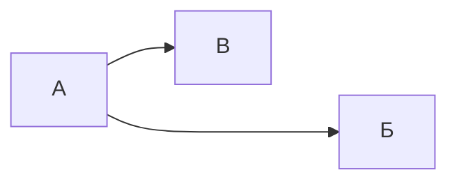

---
{"dg-publish":true,"permalink":"/style-test/","dgHomeLink":true,"dgPassFrontmatter":false,"dgShowLocalGraph":true,"dgShowBacklinks":true}
---


# Style test

# Заголовок 1

## Заголовок 2

### Заголовок 3

#### Заголовок 4

##### Заголовок 5

###### Заголовок 6

Размер самого текста тоже интересен

## Цитаты

> Переход в мир логарифмов сохранил астрономам тысячи лет жизни.
>
> Лапласс

## Код

Строчный `код`, доступный в любом месте.

```c
int main() {
	printf("Hello word");
}
```

## Таблицы

| Столбец 1 | Столбец 2 |
| --------- | --------- |
| Строка 1  | Строка 1  |
| Строка 2  | Строка 2  |

## Форматирование текста

- **Жирное выделение**
- *Курсивное выделение*
- ==Цветное выделение==
- ~~Зачёркнутый текст~~

## Mermaid



## Вставка страниц


<div class="transclusion internal-embed is-loaded"><div class="markdown-embed">


# Математические методы прикладной электродинамики

- Мат. методы прикладной электродинамики подразделяются на 2 большие темы:
	- [[Краевая задача|Краевая задача]], её решение, которое применяется для расчёта [[Волновод|волновод]]ов;
	- [[Интегральное уравнение|Интегральное уравнение]], его решение, которое применяется для расчёта антенн.

## Основные темы дисциплины

- [[Метод разделения переменных|Метод разделения переменных]] — основной применяемый метод для решения [[Дифференциальное уравнение|дифференциального уравнения]].
	- [[Метод Фурье|Метод Фурье]] — МРП применительно к [[Дифференциальное уравнение в частных производных|дифференциальным уравнениям в частных производных]].
- [[Уравнения Максвелла|Уравнения Максвелла]] — уравнения, описывающие все электромагнитные явления.
- [[Волновое уравнение|Волновое уравнение]] — лежит в основе всего. Где оно используется:
	- [[Задача малых продольных колебаний однородного стержня|Задача малых продольных колебаний однородного стержня]]
	- [[Задача малых поперечных колебаний струны|Задача малых поперечных колебаний струны]]
- [[Дисперсия волн|Дисперсия волн]]
	- [[Дисперсионное уравнение|Дисперсионное уравнение]] — уравнение зависимости частоты волны от [[Волновой вектор|волнового вектора]].
- [[Проекционные методы|Проекционные методы]] — средство нахождения приближенных представлений электромагнитного поля.
	- [[Метод частичных областей|Метод частичных областей]]
- [[Вариационный метод|Вариационный метод]]
- [[Спектральный метод|Спектральный метод]]
- [[Пути постановки задачи в электродинамике|Пути постановки задачи в электродинамике]]
- [[Как в волноводе навязывается конкретная волна|Как в волноводе навязывается конкретная волна]]

---

- [[Базис|Базис]]

## Задачи на стык

1. [[Задача расчёта собственных значений и полей П-образного волновода|Задача расчёта собственных значений и полей П-образного волновода]].
2. Задача расчёта стыков двух П-образных волноводов, которые отличаются размером гребня. 18:45.
3. Задача расчёта стыка П-образного волновода с МПЛ.
4. Задача расчёта экранированной МПЛ.
5. Задача расчёта стыка коаксиального кабеля и экранированной МПЛ.

### Теория (изучить)

- [[Скалярный потенциал|Скалярный потенциал]]
- [[Дифференциальный оператор|Дифференциальный оператор]]
	- [[Оператор набла|Оператор набла]]
	- [[Градиент|Градиент]]
	- [[Ротор|Ротор]]
	- [[Дивергенция|Дивергенция]]
- Модуль Юнга
- Теорема Гука


</div></div>

